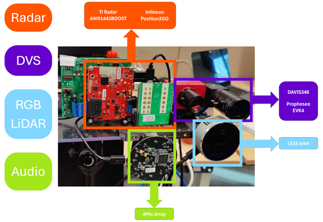
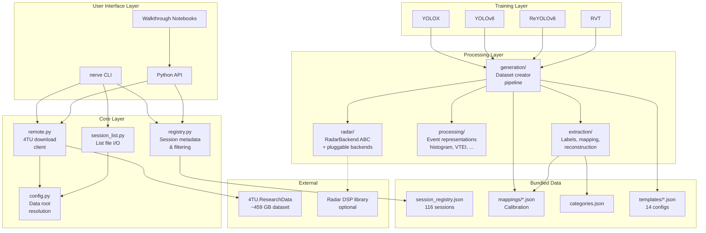
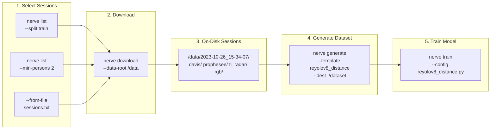
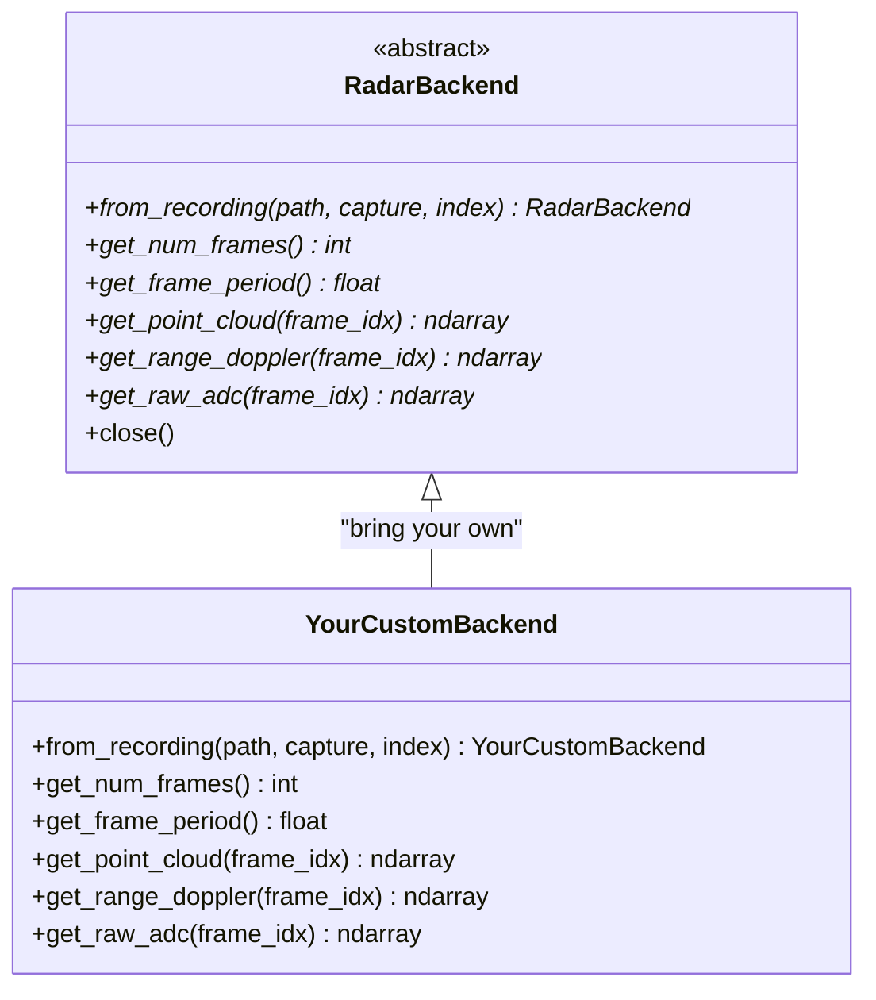
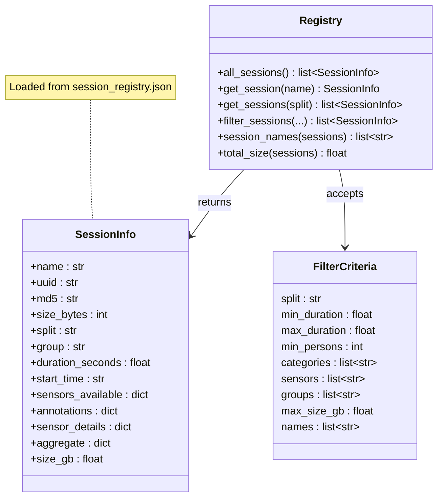
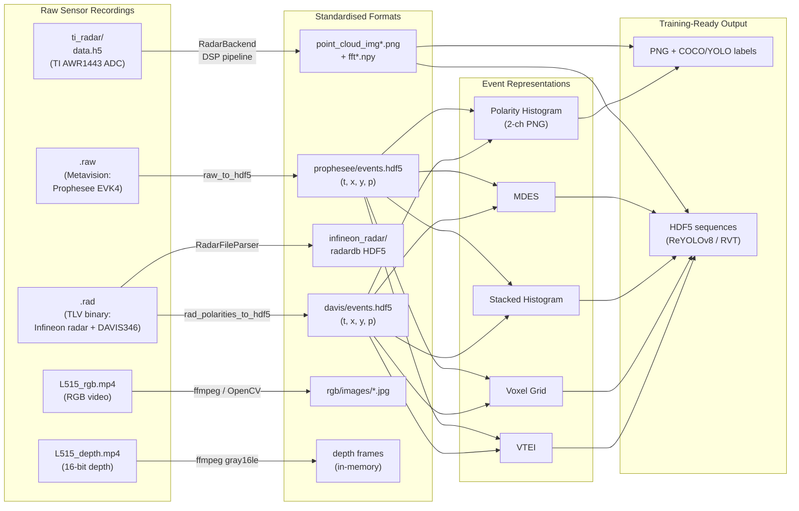

# NERVE: Neuromorphic Vision and Radar Ensemble

**Companion toolkit for the [NERVE dataset](https://data.4tu.nl/private_datasets/BaEVPhT4moLWOb77YHjr8lzQlaF2F1vG441wRd3i7ek) hosted on 4TU.ResearchData.**

Selectively download, explore, process, and train on a ~459 GB multi-modal sensor fusion dataset with 116 recording sessions, ~915k annotated frames per camera POV, and 23.5 million COCO-format annotations across all sensor viewpoints, from the command line or a Python script.

---

## Table of Contents

- [Dataset Overview](#dataset-overview)
- [Sensor Setup](#sensor-setup)
- [Session Archive Structure](#session-archive-structure)
- [Architecture](#architecture)
- [Installation](#installation)
- [Quick Start](#quick-start)
- [CLI Reference](#cli-reference)
- [Python API](#python-api)
- [Dataset Generation](#dataset-generation)
- [Model Training](#model-training)
- [Walkthrough Notebooks](#walkthrough-notebooks)
- [Advanced: Extending the Pipeline](#advanced-extending-the-pipeline)
- [FAIR Compliance](#fair-compliance)
- [Citation](#citation)
- [License](#license)

---

## Dataset Overview

NERVE is a comprehensive multi-sensor dataset designed for neuromorphic vision research and multi-modal sensor fusion. It combines event-based cameras, mmWave radar, and RGB-D sensing with dense COCO-format annotations.


| Property          | Value                                                                |
| ----------------- | -------------------------------------------------------------------- |
| Total duration    | ~257 minutes across 116 sessions                                     |
| Total storage     | ~459 GB (compressed archives)                                        |
| Annotated frames  | 914,569 per RGB POV (2.57 M across all three camera viewpoints)      |
| Total annotations | 9.6 million per RGB POV (23.5 million across all three viewpoints)   |
| Object categories | 16 prominent COCO classes (>= 5,000 RGB-POV annotations each); 55 distinct classes appear overall and the full 80-class COCO taxonomy is supported |
| Recording period  | October 2023 - January 2024                                          |
| Official splits   | 94 train / 11 val / 11 test                                          |
| Format            | `.tar.gz` per session, COCO JSON, HDF5 events, HDF5 radar, MP4 depth |


### The 16 prominent COCO classes

These are the COCO categories with at least 5,000 annotations on the RGB POV (`Intel_L515`) summed across all 116 sessions. They cover the bulk of the annotation mass in NERVE and are the recommended focus for benchmarking; the remaining 39 classes that also appear in the dataset are sparse (a few thousand annotations or fewer combined).

| Rank | Class           | RGB-POV annotations |
| ---- | --------------- | ------------------: |
| 1    | `chair`         |           3,512,576 |
| 2    | `person`        |           2,221,843 |
| 3    | `laptop`        |           1,296,998 |
| 4    | `tv`            |             490,014 |
| 5    | `cup`           |             483,217 |
| 6    | `bottle`        |             421,004 |
| 7    | `potted plant`  |             283,367 |
| 8    | `cell phone`    |             271,528 |
| 9    | `dining table`  |             253,335 |
| 10   | `mouse`         |             152,805 |
| 11   | `keyboard`      |             125,126 |
| 12   | `book`          |              41,683 |
| 13   | `wine glass`    |              25,811 |
| 14   | `refrigerator`  |              24,898 |
| 15   | `remote`        |              12,664 |
| 16   | `apple`         |               5,555 |


### What makes NERVE unique

- **Five synchronized sensors** spanning three modalities (neuromorphic vision, radar, conventional RGB-D)
- **Dense annotations** projected into every sensor's coordinate space -- not just RGB
- **Per-annotation distance** extracted from aligned LiDAR depth
- **Privacy-preserving** -- raw RGB video is excluded; only reference frames and semantic annotations are shipped
- **Session-level metadata** enabling programmatic filtering without downloading anything

---

## Sensor Setup

NERVE uses five sensors mounted in a fixed indoor laboratory configuration:





| Sensor                   | Type                   | Resolution              | Key Specs                                      |
| ------------------------ | ---------------------- | ----------------------- | ---------------------------------------------- |
| **Prophesee EVK4**       | Event camera (DVS)     | 1280 x 720        | 120 dB dynamic range, ~10k fps equivalent      |
| **iniVation DAVIS346**   | Event camera (DVS+APS) | 346 x 260         | 120 dB, combined events + grayscale frames     |
| **TI AWR1443BOOST**      | FMCW radar (77 GHz)    | 128 range bins          | 3TX/4RX, 4 cm range resolution, 10 m max range |
| **Intel RealSense L515** | RGB-D camera (LiDAR)   | 1920 x 1080 (RGB) | 0.25-9 m depth, 0.5% accuracy            |
| **Infineon Position2Go** | FMCW radar (24 GHz)    | --                 | 0.9 m range resolution                         |


All sensors are synchronized with +/-20 ms accuracy. Calibration extrinsics (rotation + translation matrices) and intrinsics are bundled with the package under `nerve/data/mappings/`.

---

## Session Archive Structure

Each session is a `.tar.gz` archive that extracts to:

```
2023-10-26_15-37-59/
├── session_metadata.json            # SensorML-inspired: sensors, stats, per-category annotation counts
├── timings.json                     # Per-sensor Unix epoch offsets for synchronization
├── davis/
│   ├── events.hdf5                  # DAVIS346 raw events (t, x, y, polarity)
│   ├── annotations/annotations.json # COCO labels mapped to DAVIS coordinate space
│   └── images/0.jpg                 # Reference frame
├── prophesee/
│   ├── events.hdf5                  # Prophesee EVK4 raw events (t, x, y, polarity)
│   ├── evk4_events.bias             # EVK4 sensor bias settings
│   ├── annotations/annotations.json # COCO labels mapped to Prophesee coordinate space
│   └── images/0.jpg
├── rgb/
│   ├── annotations/annotations.json # COCO labels in RGB camera space (richest)
│   └── images/0.jpg
├── L515_depth.mp4                   # Encoded depth video (Intel L515)
├── L515_depth_confidence.mp4        # Depth confidence map video
├── L515_depth_unit.txt              # Scale factor (0.000250 m/pixel-value)
├── infineon_radar/                  # Infineon Position2Go 24 GHz radar (radardb format)
│   ├── recording.xml
│   └── captured_data/set000/
│       ├── infineon_p2g.xml
│       └── data.h5                  # ADC frames [chirps, TX, RX, samples, I/Q]
└── ti_radar/
    ├── recording.xml
    ├── meta_data/scenario.xml
    └── captured_data/set000/
        ├── data.h5                  # Raw ADC data [frames, range_bins, TX, RX, chirps, IQ]
        ├── TI_xWR14xx.xml          # Radar chirp configuration
        └── ti_radar.log
```

### COCO Annotation Fields

Every annotation (across all three POVs) contains:


| Field             | Description                                                   |
| ----------------- | ------------------------------------------------------------- |
| `category_id`     | COCO class ID (1=person, 44=bottle, 47=cup, ...)              |
| `bbox`            | Bounding box `[x, y, w, h]`                                   |
| `area`            | Bounding box area in pixels                                   |
| `conf`            | Detection confidence (0-1)                              |
| `segmentation`    | Instance segmentation polygons                                |
| `keypoints`       | 17 COCO skeleton keypoints (for person class)                 |
| `parts`           | Fine-grained body part segmentation (head, torso, arms, legs) |
| `track_id`        | Temporally consistent entity ID across frames                 |
| `avg_distance`    | Mean depth distance in meters (from L515 LiDAR)               |
| `distance_points` | Sampled depth points `[x, y, depth, ...]` within the bbox     |


---

## Architecture

### Package Structure

```
nerve/                          # Repository root
├── pyproject.toml              # PEP 621 package definition
├── CITATION.cff                # Machine-readable citation
├── README.md
│
├── nerve/                      # Installable Python package
│   ├── __init__.py
│   ├── config.py               # Data root resolution, 4TU constants
│   ├── registry.py             # Session registry with metadata-based filtering
│   ├── remote.py               # 4TU download client (Referer-based auth)
│   ├── session_list.py         # Plain-text session list file I/O
│   ├── cli.py                  # Command-line interface entry point
│   │
│   ├── data/                   # Bundled package data
│   │   ├── session_registry.json
│   │   ├── mappings/*.json     # 7 sensor calibration files
│   │   └── categories.json
│   │
│   ├── extraction/             # Label extraction & sensor data access
│   │   ├── label_extractor.py
│   │   ├── custom_coco.py
│   │   ├── access/             # Raw format readers (HDF5, .rad, Prophesee)
│   │   ├── mapping/            # Cross-sensor coordinate transforms
│   │   ├── reconstruction/     # DVS-to-image reconstruction (E2VID)
│   │   ├── segmentation/       # Human body parsing (SCHP)
│   │   └── utils/              # Camera params, depth, events, timers
│   │
│   ├── processing/             # DVS event-to-frame conversions
│   │   ├── histogram.py        # Polarity histogram generator
│   │   └── event_representations.py  # VTEI, voxel grid, shist, MDES
│   │
│   ├── generation/             # Dataset generation pipeline
│   │   ├── creator.py          # Main pipeline: session → training dataset
│   │   ├── sources.py          # DataSource abstractions (DVS, radar)
│   │   ├── label_writer.py     # COCO/YOLO label output
│   │   └── templates/*.json    # 14 pre-configured generation templates
│   │
│   ├── radar/                  # Abstract radar interface
│   │   ├── __init__.py         # Backend registry & get_backend()
│   │   └── interface.py        # RadarBackend ABC
│   │
│   └── training/               # Model training infrastructure
│       ├── train.py            # Unified training entry point
│       ├── experiments/        # Base configs + ready-to-use templates
│       ├── reyolov8/           # Recurrent YOLOv8 for event sequences
│       ├── rvt/                # Recurrent Vision Transformer
│       ├── yolox/              # YOLOX frame-based detection
│       └── yolov8/             # Ultralytics YOLOv8
│
└── walkthroughs/               # 8 Jupyter notebook guides
    ├── 01_sensor_setup.ipynb
    ├── 02_raw_data_exploration.ipynb
    ├── 02b_raw_data_conversion.ipynb
    ├── 03_label_extraction.ipynb
    ├── 04_cross_sensor_mapping.ipynb
    ├── 05_event_representations.ipynb
    ├── 06_dataset_generation.ipynb
    └── 07_dataset_exploration.ipynb
```

### Component Diagram




### Data Flow: Download to Training




### Radar Backend Class Hierarchy




### Registry and Filtering Model




---

## Installation

### Prerequisites

NERVE requires **Python 3.9 or later** (3.10+ recommended for the cleanest type-hint
experience). You can check your version with:

```bash
python --version
```

We strongly recommend installing NERVE inside an isolated environment to avoid
dependency conflicts with other projects. Choose **one** of the two options below.

#### Option A -- `venv` (standard library, no extra tools needed)

```bash
# Create the environment
python -m venv .venv

# Activate it
source .venv/bin/activate        # Linux / macOS
# .venv\Scripts\activate         # Windows (cmd)
# .venv\Scripts\Activate.ps1     # Windows (PowerShell)

# Upgrade pip inside the fresh environment
pip install --upgrade pip
```

#### Option B -- Conda / Mamba

```bash
# Create the environment (pick a name you like)
conda create -n nerve python=3.10 -y

# Activate it
conda activate nerve
```


### Installing the package

With your environment active, clone the repository and install in editable mode:

```bash
git clone <repo-url> nerve
cd nerve
```

#### Basic (download + explore)

```bash
pip install -e .
```

#### With walkthrough notebooks

```bash
pip install -e ".[walkthroughs]"
```

#### With training support

```bash
pip install -e ".[training]"
```

#### Everything

```bash
pip install -e ".[all]"
```

Verify the installation:

```bash
nerve list --help
```

### Data root configuration

Session archives and extracted data are stored under a configurable **data
root** directory. This is especially useful when your home directory is on a
small drive and you want to store the (potentially hundreds of GB) dataset on
a separate volume.


| Priority    | Method                                                                   |
| ----------- | ------------------------------------------------------------------------ |
| 1 (highest) | `--data-root PATH` on any CLI command, or `data_root=` in the Python API |
| 2           | `NERVE_DATA_ROOT` environment variable (set once, used everywhere)       |
| 3 (default) | `~/.nerve/data/`                                                         |


The recommended approach for a persistent custom location is the environment
variable -- set it in your shell profile so every `nerve` command picks it up
automatically:

```bash
# Add to ~/.bashrc or ~/.zshrc (adjust the path to your external drive)
export NERVE_DATA_ROOT=/mnt/external_drive/nerve_data
```

After sourcing, all commands use that path without needing `--data-root`:

```bash
nerve download --split val           # saves to /mnt/external_drive/nerve_data/
nerve list --split val               # reads metadata cache from the same location
nerve generate --split val --template reyolov8_distance --dest ./dataset
```

Alternatively, pass `--data-root` explicitly per command (takes highest
priority, overrides both the environment variable and the default):

---

## Quick Start

### 1. List available sessions

```bash
nerve list
nerve list --split train
nerve list --max-size 1G --split train
```

### 2. Download specific sessions

```bash
# Set once (or add to ~/.bashrc) so you don't repeat --data-root every time
export NERVE_DATA_ROOT=/mnt/external_drive/nerve_data

# By name
nerve download 2023-10-26_15-37-59

# Entire split
nerve download --split val

# From a session list file
nerve download --from-file my_sessions.txt

# Filter-based
nerve download --min-persons 2 --split train

# Or pass --data-root explicitly (overrides the environment variable)
nerve download --split val --data-root /scratch/shared/nerve_data
```

### 3. Generate a training dataset

```bash
# --data-root tells the generator where sessions live
# --dest is the output directory (can be anywhere)
nerve generate --split train \
    --template reyolov8_distance --dest ./dataset
```

### 4. Train a model

```bash
nerve train --config nerve/training/experiments/templates/reyolov8_distance.py
```

### Python Quick Start

```python
from nerve import registry, remote

# Browse the dataset without downloading anything
for s in registry.filter_sessions(split="train", max_size_gb=1.0):
    print(f"{s.name}  {s.size_gb:.1f} GB  split={s.split}")

# Download a single session
remote.download_session("2023-10-26_15-37-59", data_root="./data")

# Download sessions matching a filter
remote.download_filtered(
    data_root="./data",
    split="train",
    min_persons=2,
    max_size_gb=5.0,
    dry_run=True,  # preview without downloading
)
```

---

## CLI Reference

All subcommands share these global flags:


| Flag                       | Description                            |
| -------------------------- | -------------------------------------- |
| `--data-root PATH`         | Override the session storage directory |
| `--split {train,val,test}` | Restrict to official split             |
| `--from-file PATH`         | Read session names from a `.txt` file  |


### `nerve list`

Browse and filter sessions from the built-in registry (no download required).

```bash
nerve list                                # all sessions
nerve list --split train                  # only train split
nerve list --min-duration 60              # at least 60 seconds
nerve list --min-persons 2                # at least 2 unique persons
nerve list --categories person bottle     # must contain these categories
nerve list --sensors ti_radar davis346    # must have these sensors
nerve list --max-size 2G                  # cap per-session archive size
nerve list --format json                  # machine-readable output
nerve list --export my_sessions.txt       # save results as a session list file
```

### `nerve download`

Download and extract session archives from 4TU.ResearchData.

```bash
# All examples below use an explicit --data-root; omit it if NERVE_DATA_ROOT is set.
nerve download 2023-10-26_15-37-59 2023-11-14_13-33-57 \
    --data-root /mnt/external_drive/nerve_data            # by name

nerve download --split train \
    --data-root /mnt/external_drive/nerve_data            # entire split

nerve download --from-file sessions.txt \
    --data-root /mnt/external_drive/nerve_data            # from list file

nerve download --min-persons 3 --min-duration 120 \
    --data-root /mnt/external_drive/nerve_data            # by metadata filter

nerve download --utils \
    --data-root /mnt/external_drive/nerve_data            # utils.tar.gz only

nerve download --split train --dry-run                    # preview total size (no download)
```

### `nerve generate`

Create training-ready datasets from downloaded sessions. `--data-root` tells
the generator where the extracted sessions live; `--dest` is where the
training-ready output goes (can be a different location).

```bash
nerve generate --split train \
    --data-root /mnt/external_drive/nerve_data \
    --template reyolov8_distance \
    --dest /mnt/external_drive/datasets/reyolov8_dist

nerve generate --from-file my_sessions.txt \
    --data-root /mnt/external_drive/nerve_data \
    --template yolox_yolov8_png \
    --dest ./dataset
```

### `nerve train`

Launch model training. The training config file points at the generated
dataset directory (the `--dest` from the previous step), so `--data-root` is
not needed here -- only the config path matters.

```bash
nerve train --config nerve/training/experiments/templates/reyolov8_distance.py
```

---

## Python API

### Registry

```python
from nerve import registry

# All sessions
sessions = registry.all_sessions()      # -> list[SessionInfo]

# By name
info = registry.get_session("2023-10-26_15-37-59")
print(info.name, info.size_gb, info.split, info.duration_seconds)

# By split
train = registry.get_sessions(split="train")

# Rich filtering
results = registry.filter_sessions(
    split="train",
    min_duration=30.0,
    min_persons=2,
    categories=["person", "bottle"],
    sensors=["ti_radar", "davis346"],
    max_size_gb=5.0,
)
print(f"{len(results)} sessions, {registry.total_size(results):.1f} GB")
```

### Download

```python
from nerve import remote

# Single session
remote.download_session("2023-10-26_15-37-59", data_root="./data")

# Multiple sessions
remote.download_sessions(["2023-10-26_15-37-59", "2023-11-14_13-33-57"],
                         data_root="./data")

# Entire split
remote.download_split("val", data_root="./data")

# From a session list file
remote.download_from_file("my_sessions.txt", data_root="./data")

# Filter-based download with dry run
remote.download_filtered(data_root="./data", split="train",
                         min_persons=2, dry_run=True)
```

### Session List Files

```python
from nerve.session_list import (
    read_session_list,
    write_session_list,
    export_session_list,
    resolve_session_paths,
)

# Read
names = read_session_list("my_sessions.txt")

# Write
write_session_list("filtered.txt", ["2023-10-26_15-37-59", "2023-11-14_13-33-57"])

# Export built-in split
export_session_list("train", "train_sessions.txt")

# Resolve to local paths
paths = resolve_session_paths("my_sessions.txt", data_root="./data")
```

### Radar Backend

```python
from nerve.radar import get_backend, available_backends

print(available_backends())  # e.g. ["my_backend"] if you registered one

try:
    Backend = get_backend()  # first registered backend
    radar = Backend.from_recording("./data/2023-10-26_15-37-59/ti_radar")
    print(f"Frames: {radar.get_num_frames()}")
    pc = radar.get_point_cloud(0)  # [N, 5] -> x, y, z, velocity, snr
except (ImportError, ValueError):
    print("No radar backend available. Subclass RadarBackend for your own implementation.")
```

Custom backends can be registered at runtime:

```python
from nerve.radar import register_backend, RadarBackend

class MyRadarBackend(RadarBackend):
    ...

register_backend("my_backend", MyRadarBackend)
```

---

## Raw Data Conversion

Each session archive bundles sensor data in proprietary or vendor-specific
binary formats. Before event representations or dataset generation can run,
these raw recordings must be converted to the standardised HDF5 format that
all downstream code expects. The table below summarises every conversion path
implemented in `nerve.extraction.access`.

### Conversion Pipeline Overview




### DAVIS346: `.rad` to HDF5

The DAVIS346 event camera records alongside the **Infineon Position2Go** radar
into a combined `.rad` binary file using a proprietary TLV (type-length-value)
format produced by the recording system. The same `.rad` file
contains both Infineon radar ADC frames and DAVIS346 polarity events,
multiplexed as interleaved TLV packets. `rad_polarities_to_hdf5.py` parses
this stream, extracts only the DAVIS346 events, and writes a gzip-compressed
HDF5 file with a single `events` dataset of `(t, x, y, p)` tuples plus
camera attributes (width=346, height=260).

> **Note:** The TI AWR1443BOOST mmWave radar records separately into
> `ti_radar/captured_data/set000/data.h5` -- it is **not** part of the `.rad` file.

```python
# CLI usage (stand-alone script)
python -m nerve.extraction.access.radar_dvs.rad_polarities_to_hdf5 \
    -i /data/session/radar_and_davis346_events.rad \
    -o /data/session/davis/events.hdf5

# The --avoid-support-indexes flag skips the time-lookup table
# (saves tens of MB but removes fast random-access by timestamp)
```

**What the `.rad` parser does** (`rad_file_parser.py`):

1. Opens the binary `.rad` stream and reads TLV headers.
2. Separates Infineon radar frames (`rafd` tag) from DAVIS346 polarity
  packets (`polb` tag).
3. For the HDF5 converter, only the polarity packets are used: it extracts
  `(timestamp, x, y, polarity)` tuples from each `polb` packet.
4. Writes them as a single `events` dataset in HDF5, with optional
  `support_indexes` for O(1) time-based lookups.

The parser also exposes the Infineon radar frames via `RadarFileParser.radar_frames`
for applications that need the raw Infineon ADC data.

### Prophesee EVK4: `.raw` to HDF5

The EVK4 HD event camera records in Prophesee's proprietary `.raw` format.
`raw_to_hdf5.py` uses the `metavision_core` library to iterate over the
event stream and write an equivalent HDF5 file (EVK4 resolution: 1280x720).

```python
# CLI usage
python -m nerve.extraction.access.raw_to_hdf5 \
    -i /data/session/evk4_events.raw \
    -o /data/session/prophesee/events.hdf5

# Batch conversion via shell wrapper
bash nerve/extraction/access/prophesee_hdf5_converter.sh /data/sessions/
```

> **Note:** `metavision_core` must be installed separately (Prophesee OpenEB
> package). It is not listed as a pip dependency because it requires a
> system-level installation.

### TI mmWave Radar: ADC data to point clouds

Raw radar ADC data is stored in `ti_radar/captured_data/set000/data.h5` as a
6-dimensional array `[frames, range_bins, TX, RX, chirps, IQ]`. Processing
this into usable point clouds or range-Doppler maps requires the FMCW DSP
chain (Range-FFT, Doppler-FFT, CFAR detection, beamforming).

The `nerve.radar` module provides an abstract `RadarBackend` interface with
a pluggable backend registry. Users implement their own backend by
subclassing `RadarBackend` and registering it:

```python
from nerve.radar import get_backend

Backend = get_backend()  # auto-discovers available backends
radar = Backend.from_recording("/data/session/ti_radar")

# Per-frame outputs
pc = radar.get_point_cloud(0)       # [N, 5]: x, y, z, velocity, snr
rd = radar.get_range_doppler(0)     # 2D range-Doppler map
adc = radar.get_raw_adc(0)          # raw ADC tensor
```

During dataset generation, radar point clouds are projected onto the camera
image plane and saved as `point_cloud_img__*.png` (and optionally `fft__*.npy`)
by the `Radar_source` in `nerve.generation.sources`.

### RGB and Depth Video: MP4 to frames

RGB and depth video from the Intel RealSense L515 are stored as standard MP4
files (`L515_rgb.mp4` and `L515_depth.mp4`). They are decoded on the fly
during label extraction and dataset generation:


| File                        | Codec             | Reader                           | Output              |
| --------------------------- | ----------------- | -------------------------------- | ------------------- |
| `L515_rgb.mp4`              | H.264             | OpenCV `VideoCapture`            | BGR frames          |
| `L515_depth.mp4`            | lossless gray16le | `ffmpegReaders.VideoReader_x264` | 16-bit depth arrays |
| `L515_depth_confidence.mp4` | gray (8-bit)      | `ffmpegReaders.VideoReader_x264` | Confidence masks    |


```python
from nerve.extraction.utils.ffmpegReaders import VideoReader_x264

depth_reader = VideoReader_x264(
    "/data/session/L515_depth.mp4",
    pix_fmt="gray16le",   # 16-bit depth
    width=1024, height=768,
)
depth_frame = depth_reader.readFrame()  # numpy uint16 array
```

The depth scale factor (meters per unit) is stored in `L515_depth_unit.txt`
within each session directory.

### DVS Reconstruction: Events to Synthetic Frames (E2VID)

For visualisation or models that need frame-like images from event cameras,
the E2VID reconstruction pipeline converts HDF5 event windows into intensity
images:

```bash
# Runs inference on a pretrained E2VID model
python -m nerve.extraction.reconstruction.run_reconstruction \
    --input /data/session/davis/events.hdf5 \
    --output /data/session/davis/reconstructed/
```

This produces grayscale PNG sequences that can be composed into video using
the bundled `make_video.sh` script.

### Conversion Summary


| Source format       | Sensor                          | Target format                   | Module                                                     |
| ------------------- | ------------------------------- | ------------------------------- | ---------------------------------------------------------- |
| `.rad` (TLV binary) | DAVIS346 + Infineon Position2Go | `events.hdf5` (DAVIS346 events) | `nerve.extraction.access.radar_dvs.rad_polarities_to_hdf5` |
| `.rad` (TLV binary) | Infineon Position2Go            | `infineon_radar/` radardb HDF5  | `nerve.extraction.access.radar_dvs.rad_radar_to_radardb`   |
| `.raw` (Metavision) | EVK4 HD                         | `events.hdf5`                   | `nerve.extraction.access.raw_to_hdf5`                      |
| `data.h5` (ADC)     | TI AWR1443BOOST                 | Point clouds / range-Doppler    | `nerve.radar.RadarBackend` (pluggable)                     |
| `.mp4` (H.264)      | L515 RGB                        | BGR frames                      | OpenCV `VideoCapture`                                      |
| `.mp4` (gray16le)   | L515 depth                      | 16-bit depth arrays             | `nerve.extraction.utils.ffmpegReaders`                     |
| `events.hdf5`       | DAVIS / EVK4                    | Reconstructed PNGs              | `nerve.extraction.reconstruction`                          |
| `events.hdf5`       | DAVIS / EVK4                    | VTEI / voxel / shist / MDES     | `nerve.processing.event_representations`                   |
| `events.hdf5`       | DAVIS / EVK4                    | 2-ch polarity histogram PNG     | `nerve.processing.histogram`                               |


---

## Dataset Generation

The generation pipeline converts raw session archives into training-ready datasets for different model architectures.

### Available Templates


| Template                            | Target Framework | Camera        | Output                | Features                                       |
| ----------------------------------- | ---------------- | ------------- | --------------------- | ---------------------------------------------- |
| `yolox_yolov8_png`                  | YOLOX, YOLOv8    | DAVIS346      | PNG images            | Frame-based, 2-channel polarity histogram      |
| `yolox_yolov8_event_rep`            | YOLOX, YOLOv8    | DAVIS346      | PNG / NPY             | VTEI, voxel grid, etc. as image representations |
| `yolox_yolov8_distance`             | YOLOX, YOLOv8    | DAVIS346      | PNG + TI radar        | + distance estimation (TI mmWave)              |
| `yolox_yolov8_distance_prop`        | YOLOX, YOLOv8    | Prophesee     | PNG + TI radar        | + distance estimation (Prophesee camera)       |
| `yolox_yolov8_distance_infineon`    | YOLOX, YOLOv8    | DAVIS346      | PNG + Infineon radar  | + distance estimation (Infineon P2G)           |
| `yolox_yolov8_fused_radar`          | YOLOX, YOLOv8    | DAVIS346      | PNG + radar           | Full DVS + radar fusion (3-channel images)     |
| `reyolov8_sequence`                 | ReYOLOv8         | DAVIS346      | HDF5 sequences        | Event-based recurrent video detection          |
| `reyolov8_distance`                 | ReYOLOv8         | DAVIS346      | HDF5 + TI radar       | + distance estimation (TI mmWave)              |
| `reyolov8_distance_prop`            | ReYOLOv8         | Prophesee     | HDF5 + TI radar       | + distance estimation (Prophesee camera)       |
| `reyolov8_distance_infineon`        | ReYOLOv8         | DAVIS346      | HDF5 + Infineon radar | + distance estimation (Infineon P2G)           |
| `reyolov8_distance_infineon_prop`   | ReYOLOv8         | Prophesee     | HDF5 + Infineon radar | + distance estimation (Prophesee + Infineon)   |
| `rvt_sequence`                      | RVT              | DAVIS346      | HDF5 sequences        | Recurrent Vision Transformer                   |
| `rvt_distance`                      | RVT              | DAVIS346      | HDF5 + TI radar       | + distance estimation (TI mmWave)              |
| `rvt_distance_prop`                 | RVT              | Prophesee     | HDF5 + TI radar       | + distance estimation (Prophesee camera)       |


### Template Configuration

Templates use `$NERVE_MAPPINGS` as a path sentinel that auto-resolves to the bundled calibration files:

```json
[{
  "data": "davis",
  "mapping": "$NERVE_MAPPINGS/rgb_to_davis.json",
  "frame_period_ms": 16.67,
  "output_shape": [384, 288],
  "event_representation": "vtei",
  "bins": 10,
  "store_as_hdf5": true,
  "clip_mode": "sequence"
}]
```

### Event Representations


| Name         | Channels            | Description                    |
| ------------ | ------------------- | ------------------------------ |
| `vtei`       | `bins` (default 10) | Volume of Ternary Event Images |
| `voxel_grid` | 2 x `bins`    | Temporal voxel grid            |
| `shist`      | 2 x `bins`    | Stacked polarity histogram     |
| `mdes`       | `bins`              | Mixed Density Event Stacks     |


---

## Model Training

### Supported Architectures


| Model        | Type                         | Input          | Distance Support |
| ------------ | ---------------------------- | -------------- | ---------------- |
| **YOLOX**    | Frame-based detection        | PNG            | Yes (with radar) |
| **YOLOv8**   | Frame-based detection        | PNG            | Yes (with radar) |
| **ReYOLOv8** | Recurrent event detection    | HDF5 sequences | Yes (with radar) |
| **RVT**      | Recurrent Vision Transformer | HDF5 sequences | Yes (with radar) |


### Example

```bash
# Edit the template to set your data.yaml path, then:
nerve train --config nerve/training/experiments/templates/reyolov8_distance.py
```

Or use the Python API:

```python
from nerve.training.experiments import ReYOLOv8Base

class Exp(ReYOLOv8Base):
    def __init__(self):
        super().__init__(
            dataset_path="/path/to/dataset",
            data_yaml="/path/to/data.yaml"
        )
        self.exp_name = "my_experiment"
        self.channels = 11  # 10 VTEI + 1 radar
        self.process_distance = True
```

---

## Walkthrough Notebooks

Eight guided notebooks in `walkthroughs/` take you through every stage of the dataset, from hardware setup to model training. Notebooks 01-07 use the smallest session (`2023-10-26_15-37-59`, ~403 MB) as a running example.


| #   | Notebook                  | What You Learn                                                                                                           | Requires Download?       |
| --- | ------------------------- | ------------------------------------------------------------------------------------------------------------------------ | ------------------------ |
| 01  | **Sensor Setup**          | Physical arrangement, specs, calibration matrices, synchronization                                                       | No                       |
| 02  | **Raw Data Exploration**  | Open and visualize every modality: events, depth, radar ADC, annotations                                                 | Yes (1 session)          |
| 02b | **Raw Data Conversion**   | Full conversion pipeline: `.rad` to HDF5, `.raw` to HDF5, radar ADC to point clouds, MP4 to frames, E2VID reconstruction | Yes (1 session)          |
| 03  | **Label Extraction**      | How YOLOv8 + SCHP + depth produced the COCO annotations                                                                  | Yes                      |
| 04  | **Cross-Sensor Mapping**  | Spatial/temporal projection of annotations between sensor POVs                                                           | Yes                      |
| 05  | **Event Representations** | VTEI, voxel grid, histogram, MDES side-by-side comparison                                                                | Yes                      |
| 06  | **Dataset Generation**    | End-to-end: raw session to training-ready YOLO/ReYOLOv8 dataset                                                          | Yes                      |
| 07  | **Dataset Exploration**   | Part A: aggregate stats from registry (no download). Part B: deep analysis across all local sessions                     | Part A: No / Part B: Yes |


```bash
pip install -e ".[walkthroughs]"
jupyter notebook walkthroughs/
```

---

## Advanced: Extending the Pipeline

This section explains how to extend NERVE with custom preprocessing algorithms, event representations, or entirely new sensor pipelines -- for example, spike encodings for spiking neural networks (SNNs).

### Adding a New Event Representation

The fastest way to integrate a new preprocessing method (e.g. a spike-generation scheme) is to add it as an **event representation** alongside the existing VTEI, stacked histogram, voxel grid, and MDES methods. All representation functions live in `nerve/processing/event_representations.py` and share a common signature.

**Step 1 -- Implement the encoding function**

Add your function to `nerve/processing/event_representations.py`. It must accept the standard arguments and return a NumPy array or PyTorch tensor:

```python
def my_spike_encoding(x, y, t, p, bins, height, width, device):
    """Convert raw events into a spike-based tensor representation.

    Args:
        x:      Tensor of event x-coordinates (int64, on `device`).
        y:      Tensor of event y-coordinates (int64, on `device`).
        t:      Tensor of event timestamps  (int64, on `device`).
        p:      Tensor of event polarities  (int64, on `device`).
        bins:   Number of temporal bins.
        height: Sensor height in pixels.
        width:  Sensor width in pixels.
        device: torch.device to compute on.

    Returns:
        Tensor of shape (C, height, width) where C depends on your encoding.
    """
    # Your implementation here
    ...
```

**Step 2 -- Register it in the dispatcher**

In the same file, add an `elif` branch inside `process_events()`:

```python
elif method == "my_spike_encoding":
    representation = my_spike_encoding(x, y, t, p, bins, height, width, device)
```

**Step 3 -- Create a generation template**

Copy an existing template from `nerve/generation/templates/` (e.g. `reyolov8_distance.template.json`) and set the `event_representation` field to your new method name:

```json
[{
  "data": "prophesee",
  "mapping": "$NERVE_MAPPINGS/rgb_to_prophesee.json",
  "frame_period_ms": 16.67,
  "use_raw_events": true,
  "event_representation": "my_spike_encoding",
  "bins": 10,
  "store_as_hdf5": true,
  "output_format": "rvt",
  "clip_mode": "distance"
}]
```

Then generate a dataset with:

```bash
nerve generate --split train \
    --template my_template.json \
    --dest ./my_spike_dataset
```

**Step 4 -- Ensure training compatibility**

If your representation produces a different number of output channels than the existing methods, update the experiment config accordingly. For example, in a `ReYOLOv8Base` subclass:

```python
from nerve.training.experiments import ReYOLOv8Base

class Exp(ReYOLOv8Base):
    def __init__(self):
        super().__init__(
            dataset_path="/path/to/my_spike_dataset",
            data_yaml="/path/to/data.yaml"
        )
        self.channels = <your_channel_count>
```

### Adding a New Data Source (Sensor Modality)

If the new pipeline is not just a different encoding of DVS events but an entirely new sensor type or data flow, you need to implement a `**DataSource**` subclass. This is the abstract base class that all sensor pipelines in `nerve/generation/sources.py` inherit from.

**The `DataSource` interface**

```python
from nerve.generation.sources import DataSource

class MySource(DataSource):
    def __init__(self, settings: dict, transformation_function=None, verbose=False):
        super().__init__(settings, transformation_function)
        # Load your data from settings['data_path'], configure frame period, etc.

    def GetFramePeriod_ms(self):
        """Return the duration of one frame in milliseconds."""
        ...

    def __next__(self):
        """Return the next frame/sample of data.

        Whatever you return here is passed as `data` to StoreData().
        """
        ...

    def __len__(self):
        """Return the total number of frames."""
        ...

    def Close(self):
        """Release any open file handles or resources."""
        ...

    def StoreData(self, data, directory_path: str, index: int) -> str:
        """Persist one frame to disk.

        Args:
            data:           The object returned by __next__().
            directory_path: Output directory for this session.
            index:          Frame index (for unique filenames).

        Returns:
            Tuple of (file_path, height, width).
        """
        ...
```

**Wire it into the generation pipeline**

In `nerve/generation/creator.py`, locate the `extract_from_single_session` function and add a branch for your new source type:

```python
elif el['data'] == 'my_sensor':
    el['data_path'] = os.path.join(session_path, "my_sensor_data")
    sources['my_sensor'] = MySource(el, transform_annotation_fn, verbose)
```

Then reference `"data": "my_sensor"` in your JSON template and the pipeline will instantiate your source automatically.

### Adding a New Radar Backend

The radar module (`nerve/radar/`) uses a clean **registry pattern** that is the most plug-and-play extension point in the codebase. Subclass `RadarBackend` and register it:

```python
from nerve.radar import register_backend, RadarBackend

class MyRadarDSP(RadarBackend):
    @classmethod
    def from_recording(cls, recording_path, capture_number=0, radar_index=0):
        ...

    def get_num_frames(self) -> int: ...
    def get_point_cloud(self, frame_idx: int) -> np.ndarray: ...
    def get_range_doppler(self, frame_idx: int) -> np.ndarray: ...
    def get_raw_adc(self, frame_idx: int) -> np.ndarray: ...

register_backend("my_radar_dsp", MyRadarDSP)
```

Once registered, it is available via `get_backend("my_radar_dsp")` and will be used by `Radar_source` during dataset generation.

### Extension Points Summary


| What you want to add                           | Where to implement                                                              | Effort                                                        |
| ---------------------------------------------- | ------------------------------------------------------------------------------- | ------------------------------------------------------------- |
| New event representation (e.g. spike encoding) | `nerve/processing/event_representations.py` + JSON template                     | Low -- one function + one `elif`                         |
| New sensor / data source                       | Subclass `DataSource` in `nerve/generation/sources.py` + branch in `creator.py` | Medium -- implement 5 abstract methods + pipeline wiring |
| New radar DSP backend                          | Subclass `RadarBackend` + `register_backend()`                                  | Low -- cleanest plugin pattern in the codebase           |
| New training architecture                      | Subclass `BaseConfig` in `nerve/training/experiments/`                          | Medium -- implement `to_dict()` + training script        |


---

## FAIR Compliance

NERVE is designed to meet the [FAIR data principles](https://www.go-fair.org/fair-principles/):


| Principle         | How NERVE Addresses It                                                                                                                                      |
| ----------------- | ----------------------------------------------------------------------------------------------------------------------------------------------------------- |
| **Findable**      | Session registry embeds persistent 4TU link, dataset DOI, and version. `CITATION.cff` enables automated citation.                                           |
| **Accessible**    | `nerve.remote` provides programmatic HTTP access to every file via the 4TU repository. No login required -- Referer-header authentication is built in. |
| **Interoperable** | COCO-format annotations, standard HDF5 event files, PNG/NPY outputs, JSON metadata. `session_metadata.json` follows SensorML/OGC conventions.               |
| **Reusable**      | CC-BY-NC-SA-3.0-IGO license. Full provenance (recording dates, sensor configurations, calibration parameters) embedded in every session archive.            |


---

## Citation

If you use the NERVE dataset or this toolkit in your research, please cite:

```bibtex
@misc{nerve2026,
  title   = {NERVE: Neuromorphic Vision and Radar Ensemble},
  author  = {Mansour, Omar and Martinello, Pietro and Milon, Ethan and
             Xu, Yingfu and Sifalakis, Manolis and Yousefzadeh, Amirreza
             and Tang, Guangzhi},
  year    = {2026},
  publisher = {4TU.ResearchData},
  url     = {https://data.4tu.nl/private_datasets/BaEVPhT4moLWOb77YHjr8lzQlaF2F1vG441wRd3i7ek},
}
```

A machine-readable `CITATION.cff` file is included in the repository root.

---

## License

The NERVE dataset is licensed under [CC-BY-NC-SA-3.0-IGO](https://creativecommons.org/licenses/by-nc-sa/3.0/igo/). The companion software toolkit follows the same license.